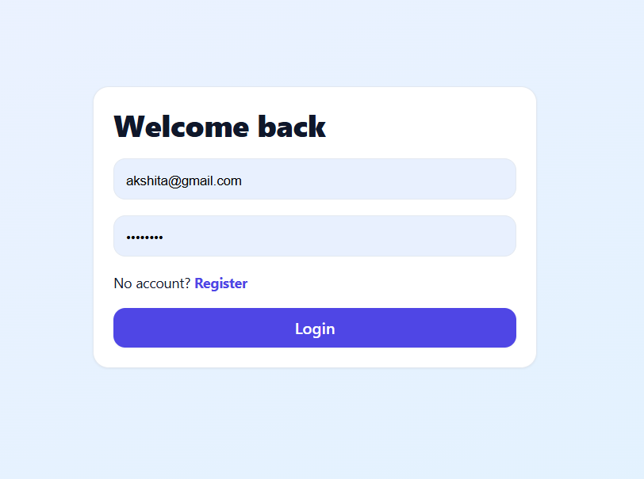
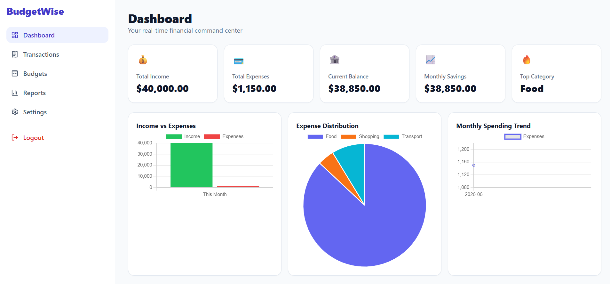
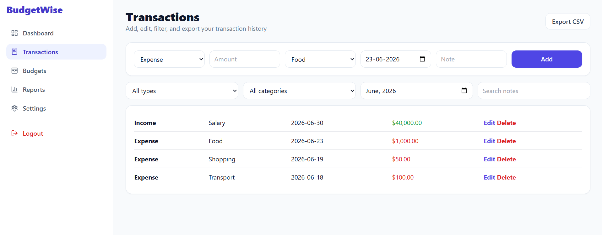
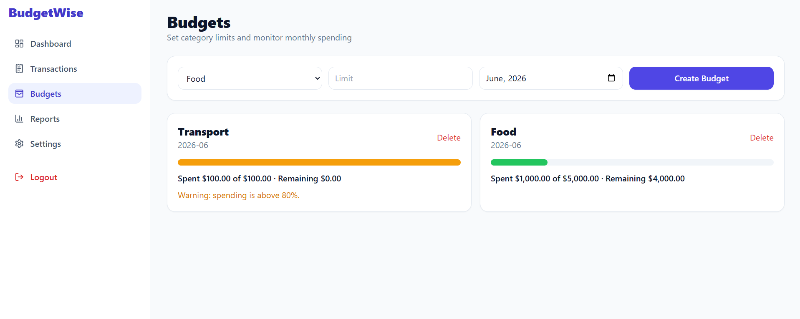
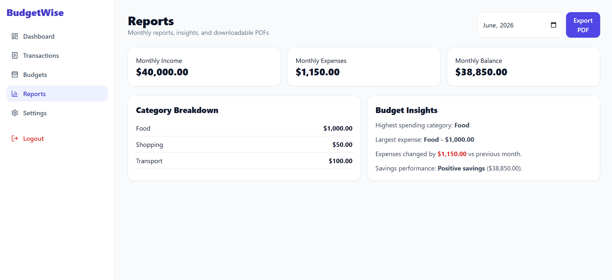

# BudgetWise – Expense Tracker with Budget Insights

A modern personal finance management application built with React, Firebase, and Chart.js. BudgetWise helps users track income and expenses, manage monthly budgets, visualize spending patterns, and generate detailed financial reports.

## Features

### Authentication

* Firebase Email/Password Authentication
* User Registration & Login
* Persistent Sessions
* Protected Routes

### Expense & Income Tracking

* Add, Edit, and Delete Transactions
* Income and Expense Management
* Transaction History
* Search and Filter Transactions
* Category and Monthly Filtering

### Budget Management

* Create Monthly Budgets by Category
* Budget Progress Tracking
* Remaining Budget Calculation
* 80% Budget Warning Alerts
* Budget Exceeded Notifications

### Analytics Dashboard

* Total Income Overview
* Total Expense Overview
* Current Balance Tracking
* Savings Summary
* Highest Spending Category

### Data Visualization

* Income vs Expense Bar Chart
* Expense Distribution Pie Chart
* Monthly Spending Trend Line Chart

### Reports & Export

* Monthly Financial Reports
* Category-wise Expense Breakdown
* Largest Expense Analysis
* Savings Insights
* Month-over-Month Comparison
* Export Transactions as CSV
* Export Reports as PDF

### User Experience

* Responsive Design
* Modern Dashboard UI
* Toast Notifications
* Loading & Empty States

---

## Tech Stack

### Frontend

* React.js (Vite)
* React Router
* Tailwind CSS
* Chart.js
* React Toastify

### Backend & Database

* Firebase Authentication
* Firebase Firestore

### Utilities

* jsPDF
* PapaParse

---

## Project Screenshots

### Login Page



### Dashboard



### Transactions



### Budgets



### Reports



---

## Installation

### Clone Repository

```bash
git clone <repository-url>
cd expense-tracker
```

### Install Dependencies

```bash
npm install
```

### Configure Environment Variables

Create a `.env` file in the project root and add:

```env
VITE_FIREBASE_API_KEY=your_api_key
VITE_FIREBASE_AUTH_DOMAIN=your_project.firebaseapp.com
VITE_FIREBASE_PROJECT_ID=your_project_id
VITE_FIREBASE_STORAGE_BUCKET=your_project.firebasestorage.app
VITE_FIREBASE_MESSAGING_SENDER_ID=your_sender_id
VITE_FIREBASE_APP_ID=your_app_id
```

### Run Application

```bash
npm run dev
```


---

## Future Improvements

* Recurring Transactions
* Multi-Currency Support
* Dark Mode
* Expense Prediction using AI
* Financial Goal Tracking
* Email Budget Alerts

---
